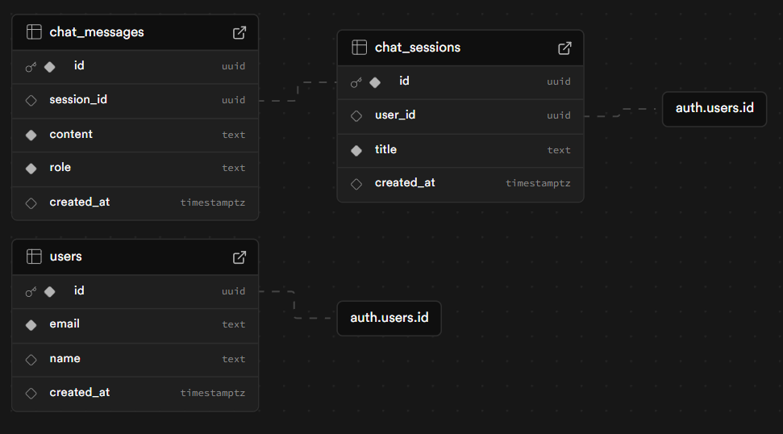

# 🩺 Health Insights Agent

AI Agent to analyze blood reports and provide detailed health insights.

<p align="center">
  <a href="#-features">Features</a> |
  <a href="#%EF%B8%8F-tech-stack">Tech Stack</a> |
  <a href="#-installation">Installation</a> |
  <a href="#-project-structure">Project Structure</a>
</p>

<p align="center">
  
</p>

## 🌟 Features

- **Agent-based architecture**
  - **Analysis Agent**: Report analysis with in-context learning from previous analyses and a built-in knowledge base
  - **Chat Agent**: RAG-powered follow-up Q&A over your report (FAISS + HuggingFace embeddings)
- **Two-model Groq fallback** with automatic recovery from the primary model to a secondary model
- **Chat sessions**: Create multiple analysis sessions; each session stores report, analysis, and follow-up messages in Supabase
- **Report sources**: Upload your own PDF or use the built-in sample report for quick testing
- **PDF handling**: Upload up to 20MB, max 50 pages; validation for file type and medical-report content
- **Daily analysis limit**: Configurable cap (default 15/day) with countdown in the sidebar
- **Secure auth**: Supabase Auth (sign up / sign in), server-side Streamlit sessions, token validation, and configurable session timeout
- **Medical-safety guardrails**: Educational—not diagnostic—AI language, medication-treatment boundaries, and immediate emergency-care guidance for clear red-flag symptoms
- **Session history**: View, switch, and delete past sessions; report text persisted for follow-up chat across reloads
- **Modern UI**: Responsive Streamlit app with sidebar session list, user greeting, and real-time feedback

## 🛠️ Tech Stack

- **Frontend**: Streamlit (1.42+)
- **AI / LLM**
  - **Report analysis**: Groq with multi-model fallback via `ModelManager`
    - Primary: `openai/gpt-oss-20b`
    - Secondary: `openai/gpt-oss-120b`
  - **Follow-up chat**: RAG with LangChain, HuggingFace embeddings (`all-MiniLM-L6-v2`), FAISS vector store, and Groq (`openai/gpt-oss-20b`)
- **Database**: Supabase (PostgreSQL)
  - Tables: `users`, `chat_sessions`, `chat_messages`
- **Auth**: Supabase Auth with an opaque HttpOnly browser-session companion
- **PDF**: PDFPlumber (text extraction) and Streamlit upload metadata validation
- **Libraries**: LangChain, LangChain Community, LangChain HuggingFace, LangChain Text Splitters, sentence-transformers, FAISS (CPU)

## 🚀 Installation

#### Requirements 📋

- Python 3.12 (recommended; Python 3.11 is also covered in CI)
- Streamlit 1.42+
- Supabase account
- Groq API key
- PDFPlumber

#### Getting Started 📝

1. Download or clone this repository:

```bash
git clone <your-repository-url>
cd <your-project-directory>
```

2. Create and activate a virtual environment:

```powershell
python -m venv .venv
.\.venv\Scripts\Activate.ps1
```

On macOS or Linux, activate it with `source .venv/bin/activate`.

3. Install the runtime dependencies:

```bash
python -m pip install -r requirements.txt
```

For development, install the runtime dependencies and test tools instead:

```bash
python -m pip install -r requirements-dev.txt
```

4. Create your local secrets file from the safe template:

```powershell
Copy-Item .streamlit/secrets.example.toml .streamlit/secrets.toml
```

On macOS or Linux, use `cp .streamlit/secrets.example.toml .streamlit/secrets.toml`.

Then replace the placeholders in `.streamlit/secrets.toml`:

```toml
SUPABASE_URL = "your-supabase-url"
SUPABASE_KEY = "your-supabase-anon-or-publishable-key"
GROQ_API_KEY = "your-groq-api-key"
APP_SESSION_INTERNAL_KEY = "a-new-random-secret-value"
```

Never commit this file. For `SUPABASE_KEY`, use only a Supabase anon or publishable key—never a Supabase service-role key, which bypasses row-level security.

5. Set up the Supabase database schema:

The application uses profiles, chat tables, and a persistent per-user analysis quota. For a new Supabase project, run [`public/db/script.sql`](public/db/script.sql). For an existing project, apply [`public/db/migrations/20260914_batch_2_rls.sql`](public/db/migrations/20260914_batch_2_rls.sql), then [`public/db/migrations/20260914_batch_4_persistent_quota.sql`](public/db/migrations/20260914_batch_4_persistent_quota.sql). The migrations link profiles to Supabase Auth, enable row-level security, and stop if they find orphaned profiles. See the [database setup and two-user isolation verification](public/db/README.md) before deploying.



(You can turn off email confirmation on signup in Supabase: **Authentication → Providers → Email → Confirm email**.)

6. Run the application with refresh-safe sign-in:

```bash
python src\run_local.py
```

This starts the app at `http://localhost:8502` and a small local sign-in service at port 8503. Stop any older `streamlit run ...` process first. The session service needs the additional `APP_SESSION_INTERNAL_KEY` value above. Generate it once with:

```powershell
python -c "import secrets; print(secrets.token_urlsafe(32))"
```

Copy the printed value into `APP_SESSION_INTERNAL_KEY`, keeping the quotation marks. It is a private secret: do not share or commit it.

## Authentication session behavior

The app does not store Supabase access or refresh tokens in browser `localStorage` or `sessionStorage`. Instead, `python src/run_local.py` uses an opaque, `HttpOnly`, same-site browser cookie. Supabase credentials stay in the local session service and Streamlit retrieves them server-to-server after a refresh. Logging out revokes the opaque session.

For a production deployment, run the companion session service behind HTTPS on the same public domain as Streamlit, use a strong unique `APP_SESSION_INTERNAL_KEY`, and set `SESSION_COOKIE_SECURE = true`. The local service is intentionally in-memory: restarting it requires users to sign in again.

## Medical safety

This application provides general educational information about laboratory reports; it does not diagnose medical conditions or replace a qualified clinician. It does not provide medication dosing or instructions to start, stop, or change treatment. For symptoms such as chest pain, severe trouble breathing, stroke-like symptoms, seizures, severe bleeding, overdose, or immediate risk of self-harm, seek urgent local medical care rather than relying on the application.

## Privacy, logs, and deployment

Health reports and chat messages are sensitive. Keep `.streamlit/secrets.toml` private, use only a Supabase anon or publishable key in the app, and rotate any API key that is exposed. The application uses privacy-safe structured operational logs: events include limited technical metadata such as a component, provider, model, and exception type. They must not contain report text, chat messages, names, email addresses, tokens, secrets, or raw exception messages.

Before deployment:

1. Run the appropriate Supabase schema and quota migrations described above, then complete the two-user isolation check in [`public/db/README.md`](public/db/README.md).
2. Configure `SUPABASE_URL`, a Supabase anon/publishable key, `GROQ_API_KEY`, and a strong unique `APP_SESSION_INTERNAL_KEY` in the deployment platform's encrypted secret settings—never in source files or build logs.
3. Use HTTPS, keep the deployment platform and Python dependencies patched, and limit project access to trusted collaborators.
4. Run `python -m pytest -q` before each deployment and confirm the deployed app can sign in, create a session, enforce its daily limit, and log out.

Do not use the application for emergency medical decisions. It is not designed to store or share medical records outside the configured Supabase project and AI provider.

## 🧪 Testing

Python 3.12 is the recommended development version. Continuous integration also tests Python 3.11 for compatibility. After installing the development dependencies, run:

```bash
python -m pytest -q
```

## 📁 Project Structure

```
health-insights-agent/
├── requirements.txt
├── requirements-dev.txt
├── pytest.ini                     # Pytest configuration (makes src importable)
├── tests/
│   ├── test_auth_security.py       # Authentication session security tests
│   ├── test_database_security.py   # Supabase schema and RLS policy tests
│   ├── test_groq_model_configuration.py # Groq model fallback configuration tests
│   ├── test_quota_and_cache_security.py # Cache and daily-limit security tests
│   ├── test_medical_safety.py      # Medical-safety guardrail tests
│   ├── test_persistent_session_security.py # Refresh-safe session security tests
│   ├── test_privacy_safe_logging.py # Privacy-safe logging tests
│   ├── test_session_titles.py      # Patient-safe session-title tests
│   └── test_validators.py          # Validation test suite
├── README.md
├── src/
│   ├── main.py                 # Application entry point; chat UI and session flow
│   ├── auth/
│   │   ├── auth_service.py     # Supabase auth, sessions, chat message persistence
│   │   ├── persistent_session.py # Refresh-safe browser-session helpers
│   │   └── session_manager.py # Session init, timeout, create/delete chat sessions
│   ├── session_server.py       # Opaque HttpOnly-cookie session companion service
│   ├── run_local.py            # Starts the companion service and Streamlit together
│   ├── components/
│   │   ├── analysis_form.py    # Report source (upload/sample), patient form, analysis trigger
│   │   ├── auth_pages.py       # Login / signup pages
│   │   ├── footer.py           # Footer component
│   │   ├── header.py           # User greeting
│   │   └── sidebar.py          # Session list, new session, daily limit, logout
│   ├── config/
│   │   ├── app_config.py       # App name, limits (upload, pages, analysis, timeout)
│   │   ├── prompts.py          # Specialist prompts for report analysis
│   │   └── sample_data.py      # Sample blood report for "Use Sample PDF"
│   ├── services/
│   │   ├── ai_service.py       # Analysis + chat entry points; vector store caching
│   │   ├── medical_safety.py   # Medical safety checks and disclaimers
│   │   └── report_cache.py     # Report-analysis cache helpers
│   ├── agents/
│   │   ├── analysis_agent.py   # Report analysis, rate limits, knowledge base, in-context learning
│   │   ├── chat_agent.py       # RAG pipeline (embeddings, FAISS, query contextualization)
│   │   └── model_manager.py   # Groq primary/secondary fallback
│   └── utils/
│       ├── app_logging.py      # Privacy-safe structured logging
│       ├── pdf_extractor.py    # PDF text extraction and validation
│       ├── session_titles.py   # Patient-safe session-title formatting
│       └── validators.py       # Email, password, PDF file and content validation
├── public/
│   └── db/
│       ├── script.sql          # Fresh Supabase schema with Auth trigger and RLS
│       ├── migrations/         # One-time migrations for existing projects
│       ├── README.md           # Setup and two-user RLS verification
│       └── schema.png          # Schema diagram
```